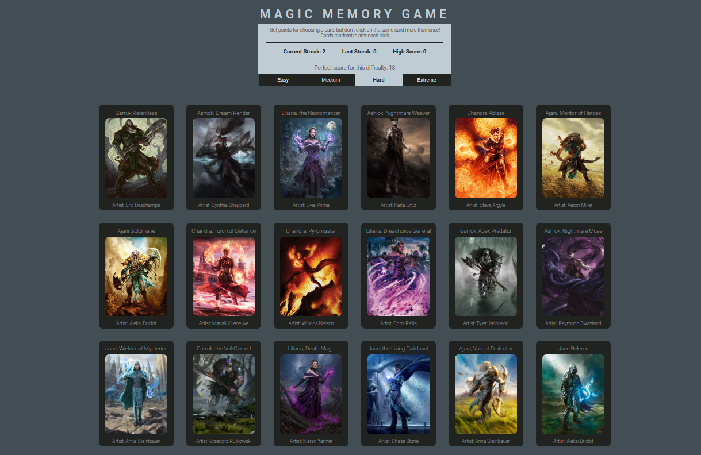

# Memory Game App
A memory game with difficulty options and randomization.

Built in React, the game features card art from various Magic The Gathering cards.
Cards randomize afer each click. Get points for choosing a card, but don't click on the same card more than once! 

Try to get the top score of each difficulty, the randomization makes it very difficult.

[Play Here](https://jmilll.github.io/memory-game/)

## Example
### Easy Mode

###  Hard Mode

###  Extreme Mode

[Play Here](https://jmilll.github.io/memory-game/)

## Features

* React
* Difficulty options
* Randomization on click
* Score tracking
* Images from Magic The Gathering

## Motivation

The purpose of this project was to use React hooks and lifecycle methods.

## Technologies Used

* React
* JavaScript
* HTML / CSS
* Flexbox

## Acknowledgements

This project was inspired by [The Odin Project memory game](https://www.theodinproject.com/courses/javascript/lessons/memory-card#assignment) online learning curriculum.

## License

I do not own any rights to the images used

MIT